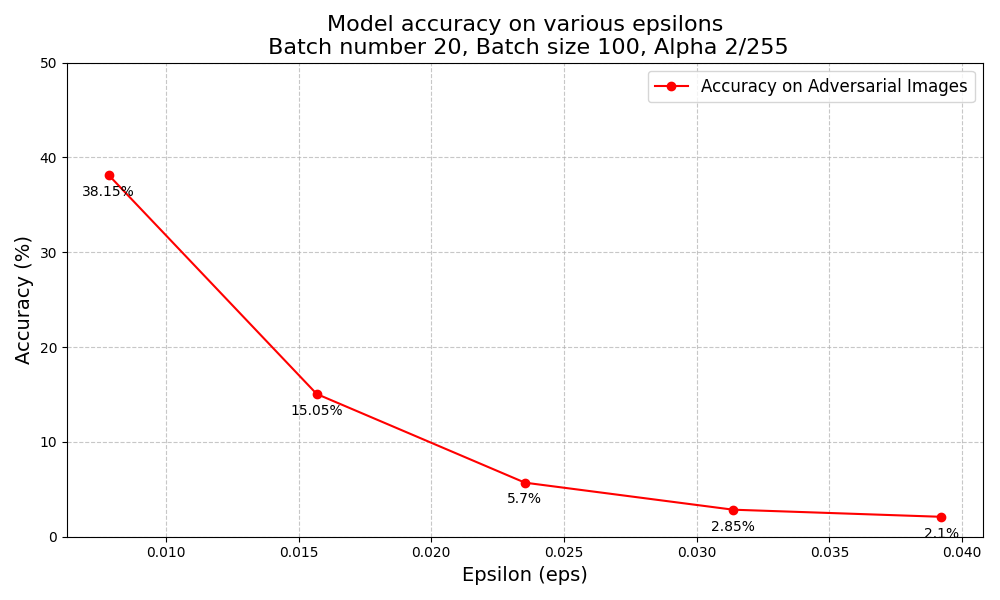
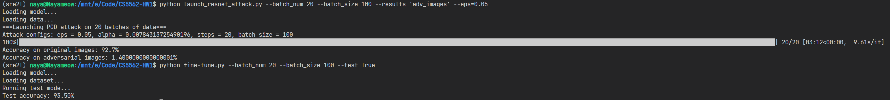

# Report for HW1

## Part 1

### Question 1

For the point (0.2, 0.8), as $\sqrt{0.2^2 + 0.8^2} = \sqrt{0.04 + 0.64} = \sqrt{0.68} \approx 0.8246 < 1$. To cause misclassification, the epsilon should be set to a value greater than $1 - 0.8246 = 0.1754$.

For the point (-0.6, 0.6), as $\sqrt{(-0.6)^2 + 0.6^2} = \sqrt{0.36 + 0.36} = \sqrt{0.72} \approx 0.8485 < 1$, the epsilon should be set to a value greater than $1 - 0.8485 = 0.1515$.

### Question 2

To make sure that every point within the circle has the chance to be misclassified, the minimum epsilon should be set to 1, as the radius of the circle is 1.

If epsilon equals 1, then the maximum possible distance between the adversarial example of the point (0.2, 0.8) and the circle boundary is $1 - 0.1754 = 0.8246$.

## Part 2

### Question 3

We can get the output of various epsilons and plot them to see the trend:

### Question 4

To make the model more robust, we can finetune the model by feeding the adversarial images we just created. Below is the implementation of the finetuning process.

#### Arguments

We use similar arguments as in the attacking part.

- `--eps`: Maximum perturbation for PGD attack (default: 8/255)
- `--alpha`: Step size for PGD attack (default: 2/255)
- `--steps`: Number of steps for PGD attack (default: 20)
- `--batch_size`: Batch size for PGD attack (default: 100)
- `--batch_num`: Number of batches on which to run PGD attack (default: None, calculated based on dataset size)
- `--seed`: Set manual seed value for reproducibility (default: 1234)
- `--epoch`: Number of epochs for training (default: 10)
- `--resultsdir`: Name of the folder to save the results (default: 'results')
- `--test`: Set to True to run test mode for evaluation (default: False)

#### Adversarial Training

We implement the `adversarial_train` function to finetune the model on the adversarial images. It can choose the following two methods:

- generate the adversarial images on the fly
- use the pre-generated adversarial images

To improve robustness and also balance the performance on the original dataset, we use the following loss function:
$$
L = L_{clean} + L_{adv}
$$

where $L$ is the total loss, $L_{clean}$ is the loss on the clean images, and $L_{adv}$ is the loss on the adversarial images. The loss function we use in this experiment is cross-entropy loss.

When updating the model, we only update the weights of the fully connected layer, and leave the weights of the convolutional layers unchanged. This is also because we want to balance the performance on the original dataset by freezing the learnt features by the convolutional layers.

#### Evaluation

We implement the `compute_accuracy` function to evaluate the model on an unseen test set.

The hyperparameters for the finetuning process are:

- `eps`: 8/255
- `alpha`: 2/255
- `steps`: 20
- `batch_num`: 20
- `batch_size`: 100

For the model trained on adversarial images with epsilon=8/255 and epochs=10, we get the following results:

| Adversarial images | Accuracy |
| --- | --- |
| epsilon=6/255 | 70.75% |
| epsilon=10/255 | 54.04% |

To improve the performance, we can use more adversarial images with different epsilons and train the model on them. Below is the performance of the model trained on adversarial images with epsilon=2/255, 4/255, 6/255, 8/255, 10/255. The model is tested on the adversarial images with a rather large epsilon (0.05). We can see that the performance withou adversarial training is much lower than the performance with adversarial training (from 1.4% to 93.5%).

Link to all the code: https://github.com/NayameoW/CS5562-HW1

Link to the model: https://drive.google.com/file/d/15WHbLLpQv-S-P3AqKNXp8WD1xaF94ZxH/view?usp=sharing